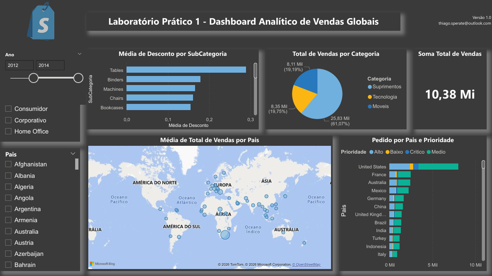

# 📊 Dashboard Analítico de Vendas Globais

📄 [Baixar versão em PDF](Lab01.pdf)

Projeto desenvolvido em Power BI para análise de vendas globais, com foco na geração de insights estratégicos para tomada de decisão.

---

## 🎯 Objetivo

Analisar o desempenho de vendas e identificar padrões por categoria, país, descontos e prioridades de entrega.

---

## ❓ Perguntas de Negócio

* Qual o valor total vendido?
* Quantas vendas foram realizadas por categoria de produto?
* Quantas vendas foram realizadas por país considerando a prioridade de entrega?
* Qual foi a média de desconto nas vendas por subcategoria?
* Quais países possuem maior média de valor de vendas?

---

## 📈 Principais Insights

- Total de vendas superior a 10 milhões
- Categoria "Suprimentos" representa a maior fatia de vendas
- Estados Unidos lidera em volume de pedidos
- Subcategorias como Tables apresentam maiores médias de desconto

---

## 💡 Valor para o Negócio

Este dashboard permite:

- Identificar categorias mais rentáveis
- Analisar performance de vendas por país
- Avaliar impacto de descontos nas vendas
- Apoiar decisões estratégicas comerciais

---

## 📁 Arquivos do Projeto

* `Lab1.pbix` → Arquivo do Power BI
* `Lab1.pdf` → Versão para visualização
* `Lab1.png` → Imagem do dashboard

Projeto desenvolvido com base em estudos do curso de Power BI da Data Science Academy (DSA), com adaptações, análises e interpretações próprias.

---

## 🛠️ Tecnologias Utilizadas

* Power BI
* DAX
* Modelagem de dados

---

## 👨‍💻 Autor

Thiago Sperate 😎  
Analista de Dados 📊  

📎 LinkedIn: https://www.linkedin.com/in/thiagosperate/  
📁 Portfólio: https://github.com/ThSperate
